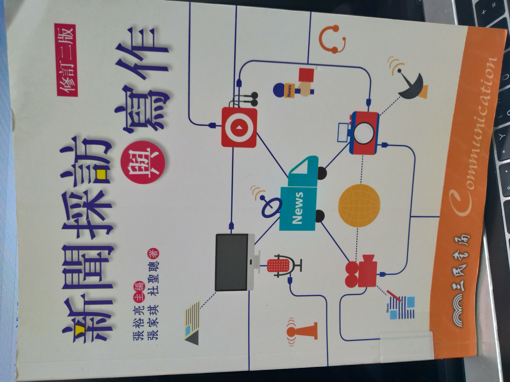
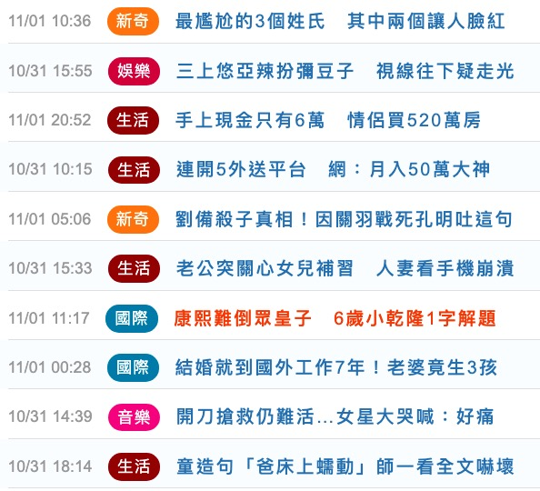
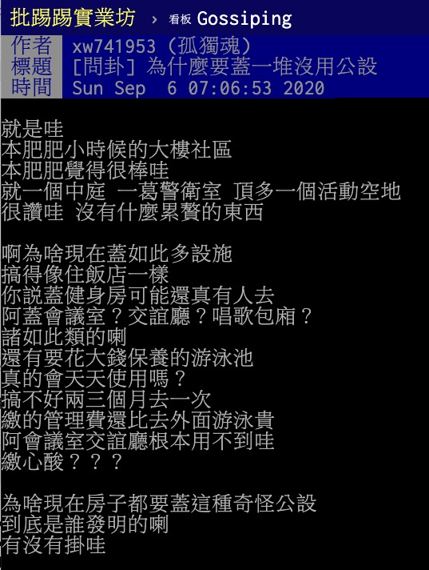

<style type="text/css">

.remark-slide-content {
    padding: 1em 1em 1em 1em;
    font-size: 28px;
}

.my-one-page-font {
  padding: 1em 1em 1em 1em;
  font-size: 20px;
  /*xaringan::inf_mr()*/
}

</style>

```{r message=FALSE,warning=FALSE,echo=FALSE}
library(tidyverse)
library(lubridate)
library(plotly)

### read
df_storm_clean <- read_rds("data/df_storm_clean.rds")
df_udn_clean <- read_rds("data/df_udn_clean.rds")
df_udn_clean_flag_tmp <- read_rds("data/df_udn_clean_flag_tmp.rds")
df_storm_clean_flag_tmp <- read_rds("data/df_storm_clean_flag_tmp.rds")
df_udn_stars_clean_tag_tmp <- read_rds("data/df_udn_stars_clean_tag_tmp.rds")

vector_type_storm <- df_storm_clean %>% mutate(type = map_chr(tag, 1)) %>%
  count(type, sort = T) %>% head(5) %>% pull(type)
vector_type_udn <- c("文教","數位","Oops","生活","閱讀","運動")
# vector_type_udn <- df_udn_clean %>% mutate(type_split = str_split(type, "_")) %>%
#   mutate(type_length = map_int(type_split, length)) %>% filter(type_length == 3) %>%
#   mutate(type2 = map_chr(type_split, 2)) %>% count(type2, sort = T) %>% head(6) %>% pull(type2)

keyword_machine <- c("監視器|記錄器|秘錄器") 
keyword_web <- c("PTT|Ptt|ptt|批踢踢|DCARD|Dcard|dcard|迪卡|低卡|爆料公社|爆.*社|爆社|臉書社團|網友")

plotly_storm_web_not <- read_rds("data/plotly_storm_web_not.rds")
plotly_storm_date_pv <- read_rds("data/plotly_storm_date_pv.rds")
plotly_storm_pv_n <- read_rds("data/plotly_storm_pv_n.rds")
plotly_storm_web_type <- read_rds("data/plotly_storm_web_type.rds")
plotly_udn_pv_n <- read_rds("data/plotly_udn_pv_n.rds")
plotly_udn_web_type <- read_rds("data/plotly_udn_web_type.rds")
plotly_pv_nake_flag <- read_rds("data/plotly_pv_nake_flag.rds")
plotly_pvmedian_nake_flag <- read_rds("data/plotly_pvmedian_nake_flag.rds")
plotly_gender_nake_where <- read_rds("data/plotly_gender_nake_where.rds")
plotly_gender_nake_flag <- read_rds("data/plotly_gender_nake_flag.rds")
```

```{r out.width='35%', out.height='35%',echo=FALSE, fig.align = "center"}

```

.center[「綜上所述，新聞綜藝化、或是綜藝化的新式新聞、網路上的道聽途說，皆不符合上述新聞定義的要求，最起碼他不符合正規新聞學的要求。換言之，不是經由新聞專業人員所做的新聞報導和寫作，皆非本書討論的範圍。」 - 張裕亮等《新聞採訪與寫作》]

---

# 實際上看到的是

```{r out.width='40%', out.height='40%',echo=FALSE}


```

.pull-left[三立]
.pull-right[聯合]

---

# 不純淨的新聞

<ul>
<li>三器新聞
    <ul>
    <li>網路瀏覽器、監視器、行車記錄器</li>
    <li>網路瀏覽器 - 引用PTT、Dcard、爆料公社、臉書粉專、網友</li>
    <li>監視器與習車記錄器 - 擷取畫面</li>
    </ul>
</li>
</ul>

<ul>
<li>煽腥色新聞
    <ul>
    <li>獵奇題材 - 死亡/性愛/軼聞</li>
    <li>綜藝或情色化 - 娛樂新聞</li>
    <li>標題聳動、內容誇張</li>
    </ul>
</li>
</ul>

---

# 事情的開頭是這樣

```{r out.width='65%', out.height='65%',echo=FALSE, fig.align = "center"}

```

.center[PTT八卦版文章 - 〈東森記者黃可昀給我進來〉]

---

# 報導長這樣

```{r out.width='55%', out.height='55%',echo=FALSE, fig.align = "center"}

```

.center[<a href = "https://house.ettoday.net/news/1802255">ETtoday房產雲 -
〈新大樓公設33%起跳！苦主嘆「游泳池變蓄水池」…網曝14年屋CP值最高〉</a>
]

---

# 原文長這樣

```{r out.width='40%', out.height='40%',echo=FALSE, fig.align = "center"}

```

.center[PTT八卦版文章 - 〈為什麼要蓋一堆沒用公設〉]

---

# 三器新聞 - 背景

<ul>
<li>資料概況 - UDN
    <ul>
    <li>時間 - 2020/08/23 - 2020/09/03</li>
    <li>則數 - 總共 899 則, 抄網路 267 則, 兩器 4 則</li>
    </ul>
</li>
</ul>
<ul>
<li>資料概況 - 風傳媒
    <ul>
    <li>時間 - 2020/08/20 - 2020/09/06</li>
    <li>則數 - 總共 1240 則, 抄網路 129 則, 兩器 5 則</li>
    </ul>
</li>
</ul>
<ul>
<li>問題
    <ul>
    <li>抄哪裡 - PTT/Dcard</li>
    <li>抄什麼 - 房地產/感情</li>
    <li>抄多少 - 規模/佔比</li>
    <li>抄的表現 - pave view</li>
    </ul>
</li>
</ul>

---
# 概況

```{r message=FALSE,warning=FALSE,echo=FALSE, fig.align = "center"}
plotly_storm_date_pv
```
---
# 比例

```{r message=FALSE,warning=FALSE,echo=FALSE, fig.align = "center"}
plotly_storm_web_not
```
---
# 抄些什麼 - storm

```{r message=FALSE,warning=FALSE,echo=FALSE, fig.align = "center"}
plotly_storm_web_type
```
---
class: my-one-page-font
# 抄些什麼 - storm
```{r message=FALSE,warning=FALSE,echo=FALSE, fig.align = "center"}
df_storm_clean_flag_tmp %>%
  kableExtra::kable("html") %>%
  kableExtra::kable_styling(bootstrap_options = c("striped", "hover"))
```
---
# 抄些什麼 - udn

```{r message=FALSE,warning=FALSE,echo=FALSE, fig.align = "center"}
plotly_udn_web_type
```

---
class: my-one-page-font
# 抄些什麼 - udn

```{r message=FALSE,warning=FALSE,echo=FALSE, fig.align = "center"}
df_udn_clean_flag_tmp %>%
  kableExtra::kable("html") %>%
  kableExtra::kable_styling(bootstrap_options = c("striped", "hover"))
```

---
# 表現如何 - storm

```{r message=FALSE,warning=FALSE,echo=FALSE, fig.align = "center"}
plotly_storm_pv_n
```

---
# 表現如何 - udn

```{r message=FALSE,warning=FALSE,echo=FALSE, fig.align = "center"}
plotly_udn_pv_n
```

---
# 三器新聞 - 小結

<ul>
<li>問題與結果
    <ul>
    <li>抄哪裡 - 靠北XXOO/爆X公社/PTT八卦版</li>
    <li>抄什麼 - 職場互動/回憶/房地產/感情</li>
    <li>抄多少 - UDN 有為引用網路直接分類一個標籤</li>
    <li>抄的表現 - 有抄表現好、國際新聞沒人看</li>
    </ul>
</li>
</ul>
<ul>
<li>反思
    <ul>
    <li>價值 vs. 流量 - 編輯室優先到讀者優先</li>
    </ul>
</li>
</ul>
--
<ul>
<li>回應批評
    <ul>
    <li>批評 - 大眾怪罪台灣媒體很爛/記者程度很差</li>
    <li>回應 - 啊你就愛看啊要不然幹嘛抄</li>
    <li>階段一 - 是因為讀者愛看才發的</li>
    <li>階段二 - 但帶來的流量可能不健康</li>
    </ul>
</li>
</ul>

---
# 事情的開頭是這樣

```{r out.width='65%', out.height='65%',echo=FALSE, fig.align = "center"}

```

.center[新聞原始標題 - 〈金鐘獎領獎！他『屁股蛋』整顆露出 觀眾暴動〉]
---
# 看到子軒的爛報告...全驚呆了

```{r out.width='50%', out.height='50%',echo=FALSE}


```

.pull-left[暴動]
.pull-right[曝光]
---

# 裸露新聞 - 背景

<ul>
<li>資料概況 - UDN
    <ul>
    <li>時間 - 2020/07/28 - 2020/09/27</li>
    <li>則數 - 娛樂新聞總共 3039 則, 裸露 136 則</li>
    </ul>
</li>
</ul>
<ul>
<li>問題
    <ul>
    <li>露多少 - 比例</li>
    <li>誰在露 - 性別</li>
    <li>露哪裏 - 器官/部位</li>
    <li>露的表現 - pave view</li>
    </ul>
</li>
</ul>

---
# 概況

```{r message=FALSE,warning=FALSE,echo=FALSE, fig.align = "center"}
plotly_pv_nake_flag
```

---
# 表現

```{r message=FALSE,warning=FALSE,echo=FALSE, fig.align = "center"}
plotly_pvmedian_nake_flag
```
---
# 部位

```{r message=FALSE,warning=FALSE,echo=FALSE, fig.align = "center"}
plotly_gender_nake_where
```
---
class: my-one-page-font
# 部位 - 男性
```{r message=FALSE,warning=FALSE,echo=FALSE, fig.align = "center"}
df_udn_stars_clean_tag_tmp %>%
  filter(flag_nude_sex == "F") %>% select(-flag_all2) %>%
  filter(!str_detect(title, "被控|謝和")) %>%
  group_by(flag_group) %>% arrange(desc(pv)) %>% filter(row_number() <= 2) %>%
  arrange(flag_group) %>%
  kableExtra::kable("html") %>%
  kableExtra::kable_styling(bootstrap_options = c("striped", "hover"))
```
---
class: my-one-page-font
# 部位 - 女性
```{r message=FALSE,warning=FALSE,echo=FALSE, fig.align = "center"}
df_udn_stars_clean_tag_tmp %>%
  filter(flag_nude_sex == "M") %>% select(-flag_all2) %>%
  filter(!str_detect(title, "謝和")) %>%
  group_by(flag_group) %>% arrange(desc(pv)) %>% filter(row_number() <= 4) %>%
  arrange(flag_group) %>%
  kableExtra::kable("html") %>%
  kableExtra::kable_styling(bootstrap_options = c("striped", "hover"))
```

---
# 裸露新聞 - 小結

<ul>
<li>問題
    <ul>
    <li>露多少 - 比例不高</li>
    <li>誰在露 - 女性比例遠高於男性(2.25 vs. 1.24)</li>
    <li>露哪裏 - 露的部位有性別差異</li>
    <li>露的表現 - 也是表現不錯</li>
    </ul>
</li>
</ul>
<ul>
<li>反思
    <ul>
    <li>為什麼要看這些(不乾脆看更腥羶色的)</li>
    <li>牽涉時事（如鞏固厭女風氣的性侵誣告新聞）、與名人有關（如狗仔偷拍）、看新聞有名分（關心時局好青年）、理解社會脈動（抄PTT買房新聞）</li>
    <li>更強化刻板印象、更追逐名氣、更挑起對立的爛新聞</li>
    <li>道德要求以及自律能擊敗商業誘因嗎</li>
    <li>期待能夠找到更好的商業模式</li>
    </ul>
</li>
</ul>
---
# 裸露的是誰

```{r message=FALSE,warning=FALSE,echo=FALSE, fig.align = "center"}
plotly_gender_nake_flag
```
---

class: inverse, center, middle

# Thanks 

```{r out.width='95%', out.height='95%',echo=FALSE, fig.align = "center"}
# knitr::include_graphics("image/chang_major_hub")
```
